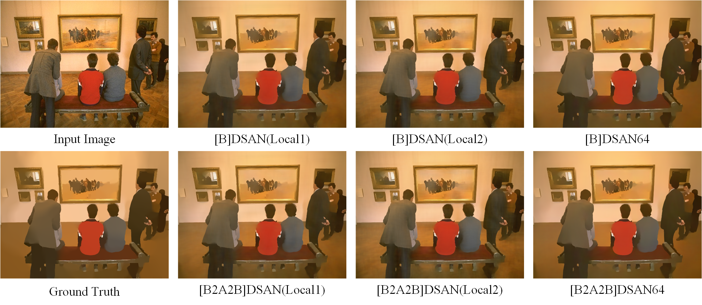

# Learning Deep Image Smoothing Operators for Continuous Model Generation

## 1. Codes for "Learning Deep Image Smoothing Operators for Continuous Model Generation" can be downloaded from [BaiDu with codes：qsqa](https://pan.baidu.com/s/15gLcKcWj5Jbb7ndaFbNuAw) or [Google Drive](https://drive.google.com/file/d/1f5k92uQvXsWtgVPQx-0hUAdyhk6HpWtx/view?usp=sharing).

## 2. Generalizability of DAS module for image super-resolution
### The codes for the networks of DAS-improved RNAN and RNAN（Our implementation of image super-resolution is achieved based on [the RNAN source codes](https://github.com/yulunzhang/RNAN)，so you need to put the  python code of our DAS-improved RNAN （rnan_das.py） into the RNAN framework when you wish to train a model with your dataset）

## 3. Some visual comparisons

  
  
Fig. 1 The visual comparison of image smoothing results when using different network architectures.
 

  
  
Fig. 2 The visual comparison of image smoothing results when using different network architectures.

  
  
Fig. 3 The visualization of smoothed images (in the first row) predicted with models generated by our CEI and the residuals (in the second row) between these images and the input image, when only a set of specific-effect label images generated is given for training.
  

  
  
Fig. 4 The visualization of smooth transition produced by the proposed CEI when the training datasets of Van Gogh's style and Cezanne's style are given for training. (a) Input images, (b, d, f) the generated images using our CEI, (c) generated Van Gogh's style images, (e) the generated Cezanne's style images
  
  

  
  
Fig. 5 The visualization of smooth transition produced by the proposed CEI when the training dataset of only Van Gogh's style is given for training. (a) Input images, (b, d, e, f) the generated images using our CEI, (c) the generated Van Gogh's style images
